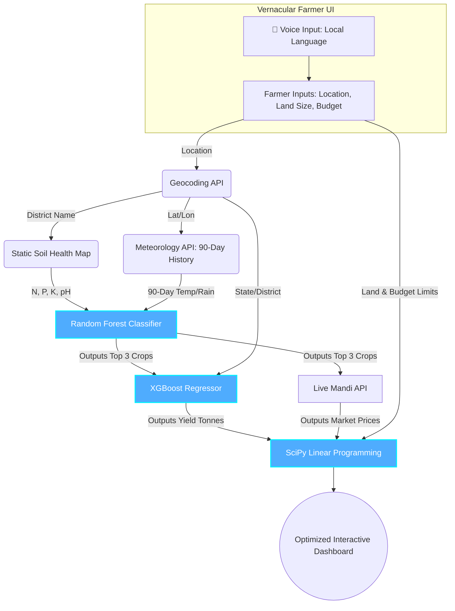

# VJH 2k26 Hackathon: Presentation Draft (Final Telugu/English Integrated Version)
**Project Title:** AI-Based Crop and Agricultural Resource Optimization System

---

## Slide 1: Team Name & Details
* **Team Name:** [Insert Team Name]
* **Team Leader Name:** [Insert Name]
* **Team Leader Mobile Number:** [Insert Number]
* **Team Leader Email:** [Insert Email]
* **College Name:** [Insert College Name]

---

## Slide 2: Domain and Problem Statement
* **Domain:** Agritech & Rural Economics
* **The Problem (The Reality of Indian Farming):** 
  * **Data is Highly Scattered:** Currently, soil data, weather forecasts, and market prices are scattered across different government portals. There is no single centralized platform for a farmer.
  * **Lack of Optimization Platforms:** While generic weather apps exist, there are zero dedicated websites that mathematically optimize a farmer's budget and land allocation.
  * **The Usability Barrier:** Whatever few agricultural AI models exist are built for engineers. They expect farmers to manually input complex metrics like "Soil Nitrogen Ratio" or "pH value," which illiterate or rural farmers cannot understand.
* **Our Goal:** To build a unified, single-stop website driven by ML and Optimization Algorithms that strictly relies on **Farmer-Friendly Inputs**.

---

## Slide 3: Idea / Solution
* **The Core Idea:** A Unified, End-to-End Agri-Financial Web Platform.
* **How it Solves the Problem:**
  * **1. Centralized Intelligence:** We bring Soil Data, Weather Data, Crop Yield Predictions, and Market Prices into one single dashboard.
  * **2. Farmer-Friendly Inputs:** The farmer ONLY provides their Village Name, Total Land, and Budget. We handle the rest.
  * **3. Actionable Output:** Instead of just saying "Grow Rice," the website acts as a financial advisor, calculating the mathematically perfect acreage split to maximize profit while keeping within the farmer's budget limits.

---

## Slide 4: Existing Vs Proposed System
* **Existing Systems:**
  * Disconnected apps (one for weather, one for mandi prices).
  * Inputs are highly technical and not user-friendly.
  * Outputs are generic (Classification only) and lack economic budgeting.
* **Our Proposed System:**
  * **Unified Ecosystem:** Everything from soil profiling to market pricing happens automatically in the background.
  * **Operations Research + ML:** We don't just predict; we optimize using Linear Programming.
  * **Vernacular UI:** Voice-first inputs in local languages making it accessible to rural India.

---

## Slide 5: Innovation & USP (Unique Selling Proposition)
*(Our innovations span across Models, Data, UX, and Economics)*

* **🤖 Advanced ML & Optimization Engine**
  * Seamlessly chaining *Random Forest* (for crop suitability) with *XGBoost* (for yield prediction) and *SciPy Linear Programming* (for budget/land optimization).
* **🎙️ Zero-Friction Farmer UX**
  * Integrated Web Speech API for voice inputs in local languages. The system completely bypasses the need for the farmer to manually enter chemical NPK values.
* **📊 Intelligent Data Integration & APIs**
  * **Data Cleaning:** Custom NLP mapping to condense 124 scattered Indian crop names into 22 highly accurate AI target classes.
  * **Historical Accuracy:** Using Open-Meteo to fetch a 90-Day Historical Weather Average to perfectly match Kaggle training conditions, rather than a generic daily snapshot.
* **📐 Indian Agricultural Unit Conversions**
  * Algorithms natively handle the conversion of government data (Hectares/Tonnes) into farmer-understandable Indian metrics (**Acres and Quintals**), ensuring the optimization math never crashes.

---

## Slide 6: Objective & Scope of Solution
* **Key Objectives:**
  * To bridge the digital divide by building an AI platform that uneducated farmers can use via Voice and simple Visual Dashboards.
  * To maximize farmer household profit while preventing the over-utilization of water and fertilizer budgets.
* **Scope:**
  * Specifically calibrated for the 22 most highly cultivated crops in India.
  * Uses a scalable District-to-Soil mapping dictionary, allowing it to easily expand across all Indian states.

---

## Slide 7: System Architecture (Logical Data Flow)
*(Note: Use this Mermaid flowchart to show exactly how data routes through the different models).*

---

## Slide 8: Detailed Resources Required
* **Machine Learning & Math:**
  * Scikit-Learn (Random Forest), XGBoost, SciPy (Linear Programming).
* **Data Sources (Kaggle):**
  * *Crop Recommendation Dataset* (Soil/Weather profiling).
  * *India Agriculture Crop Production* (Historical Yield analytics).
* **Live APIs & Mapping:**
  * **Open-Meteo:** For Geocoding and 90-Day Historical Climate Data.
  * **Mandi API / Static Economics:** For fetching Live Crop Prices per Quintal.
* **Full-Stack Technologies:**
  * **Backend:** Python & FastAPI (for lightning-fast model inference).
  * **Frontend:** React + Vite + Vanilla CSS (for Glassmorphism & Voice API integration).

---

## Slide 9: True Impact & Working Prototype
* **🌍 True Impact:**
  * We are turning complex agronomy and mathematical economics into an accessible tool. By centralizing scattered data and providing an intuitive UI, we empower smallholder farmers to escape debt cycles, make data-driven planting decisions, and maximize their land's financial potential without needing technical literacy.
  
* **💻 Working Prototype:**
  * **Link:** `http://localhost:5173`
  * **Description:** We have successfully built a full-stack prototype of the "Zero-Friction" architecture. The React frontend allows farmers to input their constraints using voice. The FastAPI backend live-fetches Geolocation and 90-Day Weather data, applies our District Soil Dictionary, and mathematically outputs a beautiful, visual dashboard detailing exactly how many acres of each crop to plant for maximum profit.
